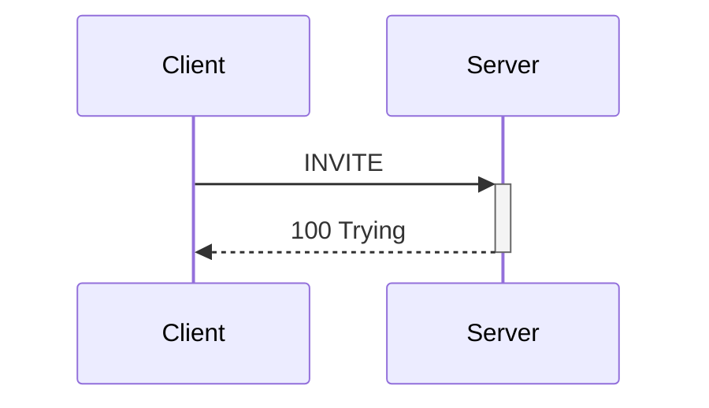

# SIP INVITE Handler Spec

## Akış Diyagramı

```mermaid
sequenceDiagram
    Client->>+Server: INVITE
    Server-->>-Client: 100 Trying
```

## Test Senaryoları
```rust
#[test]
fn test_invite_with_sdp() {
    // ...
}
```
